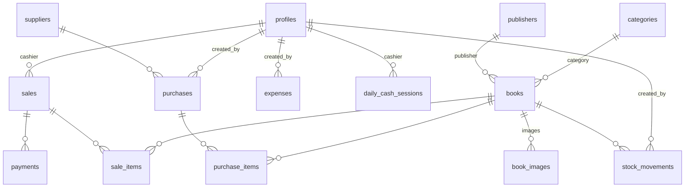

# Purpose

Define the complete PostgreSQL schema for the internal Bookstore Management & POS system: every table, enum, constraint, index, function, trigger, and the migration workflow. This file is the single source of truth for the database. `bookstore-supabase` explains how to run migrations and query from the app; this file defines *what* the schema is.

# Scope

- ERD and relationship rules.
- Enums.
- Full DDL for all tables (columns, PK/FK, unique, check constraints).
- Indexes.
- The stock-movement engine (internal `record_movement`) and the public RPC functions (`adjust_inventory`, `receive_purchase`, `create_sale`, `void_sale`, `refund_sale`).
- Triggers (profile bootstrap, `updated_at`).
- Transactions and row locking.
- Views used by reports/dashboard.
- Migration conventions and workflow.
- Money, timestamps, soft-delete conventions.

Out of scope: RLS policy statements (in `bookstore-security`), client usage (in `bookstore-supabase`), business flows per module (their own skills).

# When to Use

Every time you change the schema: new table, new column, new enum, new index, new function, new migration. Also use it as the reference when writing queries in any service. If a query needs an index that does not exist, add the index in a migration here.

# Architecture

## Entity relationship



Relationship rules:

- `book_images`, `purchase_items`, `sale_items`, `payments` cascade-delete with their parent (`ON DELETE CASCADE`).
- `books` → `categories`/`publishers`: `ON DELETE RESTRICT` (a category/publisher with books is never deleted — it is deactivated/archived).
- `purchases` → `suppliers`: `ON DELETE RESTRICT`.
- `stock_movements`, `sale_items`, `purchase_items` reference books with `ON DELETE RESTRICT` — a book with history cannot be hard-deleted (see soft delete below).
- `profiles.id` = `auth.users.id` (`ON DELETE CASCADE`).

## Conventions

- **IDs**: `uuid` PK, default `gen_random_uuid()`.
- **Money**: integer cents, column suffix `_cents`, `CHECK (x >= 0)`. Never `numeric`/`float` for money.
- **Timestamps**: `created_at timestamptz not null default now()`, `updated_at timestamptz not null default now()` (maintained by trigger). Historical/immutable rows (`stock_movements`, `audit_logs`, `sale_items`) have `created_at` only.
- **Soft delete**: use status enums. Books: `ARCHIVED`. Categories/publishers/suppliers: `is_active boolean` (deactivate; never delete rows referenced by books/purchases).
- **Enums** for statuses and types (below). TypeScript mirrors them via generated types.

## Enums

```sql
create type app_role as enum ('OWNER', 'ADMIN', 'CASHIER');
create type book_status as enum ('ACTIVE', 'INACTIVE', 'ARCHIVED');
create type purchase_status as enum ('DRAFT', 'ORDERED', 'RECEIVED', 'COMPLETED', 'CANCELLED');
create type sale_status as enum ('COMPLETED', 'VOIDED', 'REFUNDED', 'PARTIALLY_REFUNDED');
create type payment_method as enum ('CASH', 'CARD', 'TRANSFER', 'MOBILE_MONEY', 'OTHER');
create type payment_status as enum ('PENDING', 'PARTIAL', 'PAID', 'REFUNDED');
create type movement_type as enum
  ('PURCHASE', 'SALE', 'RETURN_IN', 'RETURN_OUT', 'ADJUSTMENT_IN', 'ADJUSTMENT_OUT', 'DAMAGE', 'LOSS', 'CORRECTION');
create type reference_type as enum
  ('PURCHASE_ITEM', 'SALE_ITEM', 'ADJUSTMENT', 'RETURN', 'CORRECTION');
create type expense_category as enum ('RENT', 'ELECTRICITY', 'INTERNET', 'SALARY', 'TRANSPORTATION', 'OTHER');
```

# Rules

1. **No module other than the inventory engine may modify `books.stock`.** All writes go through the functions in this file.
2. Every stock change has exactly one `stock_movements` row, written in the same transaction as the business event (sale, receive, adjustment).
3. Sale/purchase prices on saved documents are snapshots (never joined live at report time) so history never mutates.
4. Every RPC validates the caller's role internally (`assert_role`) and runs in one transaction — the database is the final authority, RLS is the gate.
5. All money columns have `CHECK (>= 0)` unless a signed value is genuinely needed (none should be).
6. Migrations are additive and chronological; never edit an applied migration.
7. No table is fetched without an index that supports the query.

# Implementation Guidance

## Full schema

```sql
-- ============ PROFILES ============
create table profiles (
  id          uuid primary key references auth.users(id) on delete cascade,
  full_name   text not null default '',
  role        app_role not null default 'CASHIER',
  phone       text,
  is_active   boolean not null default true,
  created_at  timestamptz not null default now(),
  updated_at  timestamptz not null default now()
);

-- ============ CATALOG ============
create table categories (
  id          uuid primary key default gen_random_uuid(),
  name        text not null,
  slug        text not null unique,
  description text,
  is_active   boolean not null default true,
  created_at  timestamptz not null default now(),
  updated_at  timestamptz not null default now(),
  unique (name)
);

create table publishers (
  id          uuid primary key default gen_random_uuid(),
  name        text not null unique,
  slug        text not null unique,
  country     text,
  created_at  timestamptz not null default now(),
  updated_at  timestamptz not null default now()
);

create table suppliers (
  id             uuid primary key default gen_random_uuid(),
  name           text not null unique,
  contact_person text,
  phone          text,
  email          text,
  address        text,
  notes          text,
  is_active      boolean not null default true,
  created_at     timestamptz not null default now(),
  updated_at     timestamptz not null default now()
);

create table books (
  id                   uuid primary key default gen_random_uuid(),
  isbn                 text,
  barcode              text,
  title                text not null,
  slug                 text not null unique,
  author               text not null default '',
  description          text,
  category_id          uuid references categories(id) on delete restrict,
  publisher_id         uuid references publishers(id) on delete restrict,
  publication_year     int,
  edition              text,
  language             text not null default 'English',
  purchase_price_cents int not null default 0 check (purchase_price_cents >= 0),
  selling_price_cents  int not null default 0 check (selling_price_cents >= 0),
  stock                int not null default 0 check (stock >= 0),
  minimum_stock        int not null default 0 check (minimum_stock >= 0),
  location             text,                       -- shelf/location
  status               book_status not null default 'ACTIVE',
  created_at           timestamptz not null default now(),
  updated_at           timestamptz not null default now(),
  constraint books_unique_isbn unique (isbn)
);
-- isbn/barcode may be null; a partial unique index enforces uniqueness only for non-null:
create unique index books_barcode_unique on books (barcode) where barcode is not null;

create table book_images (
  id            uuid primary key default gen_random_uuid(),
  book_id       uuid not null references books(id) on delete cascade,
  storage_path  text not null,          -- bucket-relative path, e.g. books/{book_id}/{uuid}.webp
  url           text not null,          -- CDN/public URL for display
  is_primary    boolean not null default false,
  sort_order    int not null default 0,
  created_at    timestamptz not null default now(),
  unique (storage_path)
);
-- one primary image per book:
create unique index book_images_one_primary on book_images (book_id) where is_primary;
```

```sql
-- ============ PURCHASES ============
create table purchases (
  id              uuid primary key default gen_random_uuid(),
  supplier_id     uuid not null references suppliers(id) on delete restrict,
  invoice_number  text not null unique,
  purchase_date   date not null default current_date,
  status          purchase_status not null default 'DRAFT',
  subtotal_cents  int not null default 0 check (subtotal_cents >= 0),
  discount_cents  int not null default 0 check (discount_cents >= 0),
  shipping_cents  int not null default 0 check (shipping_cents >= 0),
  tax_cents       int not null default 0 check (tax_cents >= 0),
  total_cents     int not null default 0 check (total_cents >= 0),
  payment_status  payment_status not null default 'PENDING',
  notes           text,
  created_by      uuid not null references profiles(id),
  created_at      timestamptz not null default now(),
  updated_at      timestamptz not null default now(),
  constraint purchases_total_ok check (subtotal_cents + shipping_cents + tax_cents - discount_cents = total_cents)
);

create table purchase_items (
  id                uuid primary key default gen_random_uuid(),
  purchase_id       uuid not null references purchases(id) on delete cascade,
  book_id           uuid not null references books(id) on delete restrict,
  quantity_ordered  int not null check (quantity_ordered > 0),
  quantity_received int not null default 0 check (quantity_received >= 0 and quantity_received <= quantity_ordered),
  unit_cost_cents   int not null check (unit_cost_cents >= 0),
  discount_cents    int not null default 0 check (discount_cents >= 0),
  line_total_cents  int not null check (line_total_cents >= 0),
  unique (purchase_id, book_id)
);
```

```sql
-- ============ SALES ============
create sequence sale_invoice_seq;

create table sales (
  id                  uuid primary key default gen_random_uuid(),
  invoice_number      text not null unique
                      default ('INV-' || to_char(now(), 'YYYYMMDD') || '-' || lpad(nextval('sale_invoice_seq')::text, 4, '0')),
  cashier_id          uuid not null references profiles(id),
  status              sale_status not null default 'COMPLETED',
  subtotal_cents      int not null check (subtotal_cents >= 0),
  discount_cents      int not null default 0 check (discount_cents >= 0),
  tax_cents           int not null default 0 check (tax_cents >= 0),
  total_cents         int not null check (total_cents >= 0),
  tendered_cents      int not null default 0 check (tendered_cents >= 0),
  change_cents        int not null default 0 check (change_cents >= 0),
  payment_method      payment_method not null default 'CASH',
  notes               text,
  void_reason         text,
  voided_by           uuid references profiles(id),
  voided_at           timestamptz,
  refunded_amount_cents int not null default 0 check (refunded_amount_cents >= 0),
  created_at          timestamptz not null default now(),
  updated_at          timestamptz not null default now(),
  constraint sales_total_ok check (subtotal_cents + tax_cents - discount_cents = total_cents),
  constraint sales_change_ok check (change_cents = tendered_cents - total_cents)
);

create table sale_items (
  id                 uuid primary key default gen_random_uuid(),
  sale_id            uuid not null references sales(id) on delete cascade,
  book_id            uuid not null references books(id) on delete restrict,
  quantity           int not null check (quantity > 0),
  unit_price_cents   int not null check (unit_price_cents >= 0),   -- snapshot at sale time
  unit_cost_cents    int not null check (unit_cost_cents >= 0),    -- snapshot of purchase price → profit reporting
  discount_cents     int not null default 0 check (discount_cents >= 0),
  line_total_cents   int not null check (line_total_cents >= 0),
  -- read-only snapshots so historical sales never change:
  title_snapshot     text not null,
  isbn_snapshot      text,
  created_at         timestamptz not null default now(),
  unique (sale_id, book_id)
);

create table payments (
  id          uuid primary key default gen_random_uuid(),
  sale_id     uuid not null references sales(id) on delete cascade,
  amount_cents int not null check (amount_cents > 0),
  method      payment_method not null,
  reference   text,                          -- card/transfer reference
  created_by  uuid not null references profiles(id),
  created_at  timestamptz not null default now()
);
```

```sql
-- ============ INVENTORY ============
create table stock_movements (
  id             uuid primary key default gen_random_uuid(),
  book_id        uuid not null references books(id) on delete restrict,
  quantity       int not null check (quantity <> 0),     -- signed: + in, - out
  movement_type  movement_type not null,
  reference_type reference_type,
  reference_id   uuid,
  previous_stock int not null,
  new_stock      int not null,
  unit_cost_cents int,                                    -- cost basis at movement time (PURCHASE/RETURN_IN)
  notes          text,
  created_by     uuid references profiles(id),
  created_at     timestamptz not null default now()
);
```

```sql
-- ============ OPERATIONS ============
create table expenses (
  id           uuid primary key default gen_random_uuid(),
  category     expense_category not null,
  amount_cents int not null check (amount_cents > 0),
  expense_date date not null default current_date,
  description  text,
  created_by   uuid not null references profiles(id),
  created_at   timestamptz not null default now(),
  updated_at   timestamptz not null default now()
);

create table audit_logs (
  id          uuid primary key default gen_random_uuid(),
  user_id     uuid references profiles(id),
  action      text not null,
  entity_type text not null,
  entity_id   text,
  metadata    jsonb not null default '{}'::jsonb,
  created_at  timestamptz not null default now()
);

create table store_settings (
  id                      int primary key check (id = 1),   -- singleton row
  store_name              text not null default 'My Bookstore',
  store_address           text,
  store_phone             text,
  receipt_footer          text,
  receipt_width           text not null default '80' check (receipt_width in ('58', '80')),
  currency               text not null default 'USD',
  allow_negative_stock    boolean not null default false,
  max_discount_percent    int not null default 100 check (max_discount_percent between 0 and 100),
  tax_rate_bps            int not null default 0 check (tax_rate_bps between 0 and 10000), -- basis points (0 = off)
  updated_by              uuid references profiles(id),
  updated_at              timestamptz not null default now()
);

create table daily_cash_sessions (
  id                  uuid primary key default gen_random_uuid(),
  cashier_id          uuid not null references profiles(id),
  opened_at           timestamptz not null default now(),
  opened_balance_cents int not null default 0,
  closed_at           timestamptz,
  closed_balance_cents int,
  expected_cents      int,
  variance_cents      int,
  notes               text,
  created_at          timestamptz not null default now(),
  updated_at          timestamptz not null default now()
);
```

## Indexes

```sql
create index books_category_idx on books (category_id);
create index books_publisher_idx on books (publisher_id);
create index books_status_idx on books (status);
create index books_title_idx on books (title);
create extension if not exists pg_trgm;
create index books_search_idx on books using gin (title gin_trgm_ops, author gin_trgm_ops);

create index purchase_items_purchase_idx on purchase_items (purchase_id);
create index purchase_items_book_idx on purchase_items (book_id);
create index purchases_supplier_idx on purchases (supplier_id);
create index purchases_status_idx on purchases (status);
create index purchases_date_idx on purchases (purchase_date);

create index sales_created_idx on sales (created_at desc);
create index sales_status_idx on sales (status);
create index sales_cashier_idx on sales (cashier_id);
create index sale_items_sale_idx on sale_items (sale_id);
create index sale_items_book_idx on sale_items (book_id);
create index payments_sale_idx on payments (sale_id);

create index movements_book_created_idx on stock_movements (book_id, created_at desc);
create index movements_ref_idx on stock_movements (reference_type, reference_id);
create index movements_created_idx on stock_movements (created_at desc);
create index movements_type_idx on stock_movements (movement_type);

create index expenses_date_idx on expenses (expense_date);
create index expenses_category_idx on expenses (category);
create index audit_created_idx on audit_logs (created_at desc);
create index audit_entity_idx on audit_logs (entity_type, entity_id);
create index book_images_book_idx on book_images (book_id);
```

## The stock-movement engine

Internal function — the **only** place `books.stock` is written. Locks the book row, computes new stock, enforces the negative-stock rule, writes the movement and the cached stock atomically.

```sql
create or replace function record_movement(
  p_book_id uuid, p_quantity int, p_movement_type movement_type,
  p_ref_type reference_type default null, p_ref_id uuid default null,
  p_unit_cost_cents int default null, p_notes text default null,
  p_created_by uuid default auth.uid()
) returns int
language plpgsql
security definer
set search_path = public, pg_temp
as $$
declare
  v_prev int;
  v_new  int;
  v_allow_neg boolean;
begin
  select stock into v_prev from books where id = p_book_id for update;
  if not found then
    raise exception 'BOOK_NOT_FOUND';
  end if;

  v_new := v_prev + p_quantity;
  select allow_negative_stock into v_allow_neg from store_settings where id = 1;
  if v_new < 0 and coalesce(v_allow_neg, false) = false then
    raise exception 'NEGATIVE_STOCK book=% quantity=% current=%', p_book_id, p_quantity, v_prev;
  end if;

  update books set stock = v_new, updated_at = now() where id = p_book_id;
  insert into stock_movements
    (book_id, quantity, movement_type, reference_type, reference_id,
     previous_stock, new_stock, unit_cost_cents, notes, created_by)
  values
    (p_book_id, p_quantity, p_movement_type, p_ref_type, p_ref_id,
     v_prev, v_new, p_unit_cost_cents, p_notes, p_created_by);

  return v_new;
end $$;
```

Public RPCs — each checks the caller's role, then runs its whole flow in one transaction.

```sql
create or replace function assert_role(p_roles app_role[])
returns void language plpgsql security definer set search_path = public, pg_temp as $$
declare v_role app_role;
begin
  select role into v_role from profiles where id = auth.uid();
  if v_role is null or not (v_role = any (p_roles)) then
    raise exception 'AUTHZ_DENIED';
  end if;
end $$;

-- Stock adjustment (inventory page)
create or replace function adjust_inventory(
  p_book_id uuid, p_quantity int, p_movement_type movement_type,
  p_notes text default null
) returns int
language plpgsql security definer set search_path = public, pg_temp as $$
begin
  perform assert_role(array['OWNER', 'ADMIN']);
  return record_movement(p_book_id, p_quantity, p_movement_type,
                         'ADJUSTMENT', null, null, p_notes);
end $$;
```

`create_sale` — POS checkout. **Prices are recomputed from the database; client input is never trusted.** See `bookstore-pos`/`bookstore-sales` for the calling convention.

```sql
create or replace function create_sale(
  p_items jsonb,             -- [{"book_id": uuid, "quantity": int}]
  p_payment_method payment_method default 'CASH',
  p_tendered_cents int default 0,
  p_discount_cents int default 0,
  p_notes text default null
) returns uuid
language plpgsql security definer set search_path = public, pg_temp as $$
declare
  v_cashier uuid := auth.uid();
  v_role app_role;
  v_sale_id uuid;
  v_item jsonb;
  v_book uuid; v_qty int;
  v_price int; v_cost int; v_stock int; v_line int;
  v_title text; v_isbn text;
  v_subtotal int := 0; v_total int;
  v_max_discount_pct int;
begin
  select role into v_role from profiles where id = v_cashier;
  if v_role is null or v_role not in ('OWNER', 'ADMIN', 'CASHIER') then
    raise exception 'AUTHZ_DENIED';
  end if;
  if jsonb_array_length(p_items) = 0 then raise exception 'EMPTY_CART'; end if;

  select max_discount_percent into v_max_discount_pct from store_settings where id = 1;

  -- lock all books first (ordered by id to avoid deadlocks)
  for v_item in select * from jsonb_array_elements(p_items) order by (value->>'book_id')
  loop
    v_book := (v_item->>'book_id')::uuid;
    perform 1 from books where id = v_book for update;
  end loop;

  insert into sales (cashier_id, subtotal_cents, discount_cents, total_cents,
                     tendered_cents, change_cents, payment_method, notes)
  values (v_cashier, 0, 0, 0, 0, 0, p_payment_method, p_notes)
  returning id into v_sale_id;

  for v_item in select * from jsonb_array_elements(p_items)
  loop
    v_book  := (v_item->>'book_id')::uuid;
    v_qty   := (v_item->>'quantity')::int;
    if v_qty <= 0 then raise exception 'INVALID_QUANTITY'; end if;

    select selling_price_cents, purchase_price_cents, stock, title, isbn
      into v_price, v_cost, v_stock, v_title, v_isbn
      from books where id = v_book;
    if v_stock < v_qty then raise exception 'INSUFFICIENT_STOCK book=%', v_book; end if;

    v_line := v_price * v_qty;
    insert into sale_items (sale_id, book_id, quantity, unit_price_cents, unit_cost_cents,
                            discount_cents, line_total_cents, title_snapshot, isbn_snapshot)
    values (v_sale_id, v_book, v_qty, v_price, v_cost, 0, v_line, v_title, v_isbn);

    v_subtotal := v_subtotal + v_line;
    perform record_movement(v_book, -v_qty, 'SALE', 'SALE_ITEM', v_sale_id, v_cost, null, v_cashier);
  end loop;

  if p_discount_cents < 0 or p_discount_cents > (v_subtotal * v_max_discount_pct / 100) then
    raise exception 'DISCOUNT_EXCEEDS_LIMIT';
  end if;
  v_total := v_subtotal - p_discount_cents;
  if p_tendered_cents < v_total then raise exception 'TENDERED_BELOW_TOTAL'; end if;

  update sales set subtotal_cents = v_subtotal, discount_cents = p_discount_cents,
                   total_cents = v_total, tendered_cents = p_tendered_cents,
                   change_cents = p_tendered_cents - v_total
   where id = v_sale_id;

  insert into payments (sale_id, amount_cents, method, created_by)
  values (v_sale_id, v_total, p_payment_method, v_cashier);

  return v_sale_id;
end $$;
```

`receive_purchase` — increases stock only on receiving:

```sql
create or replace function receive_purchase(p_purchase_id uuid) returns void
language plpgsql security definer set search_path = public, pg_temp as $$
declare
  v_item record;
  v_status purchase_status;
begin
  perform assert_role(array['OWNER', 'ADMIN']);
  select status into v_status from purchases where id = p_purchase_id for update;
  if v_status not in ('ORDERED', 'DRAFT') then
    raise exception 'PURCHASE_NOT_RECEIVABLE';
  end if;

  for v_item in select * from purchase_items where purchase_id = p_purchase_id
  loop
    -- partial receive: receive remaining (or the full ordered qty)
    perform record_movement(v_item.book_id, v_item.quantity_ordered - v_item.quantity_received,
                            'PURCHASE', 'PURCHASE_ITEM', p_purchase_id,
                            v_item.unit_cost_cents, 'Purchase receive');
    update purchase_items set quantity_received = quantity_ordered where id = v_item.id;
  end loop;

  update purchases set status = 'RECEIVED', updated_at = now() where id = p_purchase_id;
end $$;
```

`void_sale` and `refund_sale` — reverse stock with `RETURN_IN` movements; historical sale rows are updated, never deleted (see `bookstore-sales`):

```sql
create or replace function void_sale(p_sale_id uuid, p_reason text) returns void
language plpgsql security definer set search_path = public, pg_temp as $$
declare
  v_item record;
begin
  perform assert_role(array['OWNER', 'ADMIN']);
  if not exists (select 1 from sales where id = p_sale_id and status = 'COMPLETED') then
    raise exception 'SALE_NOT_VOIDABLE';
  end if;
  for v_item in select * from sale_items where sale_id = p_sale_id
  loop
    perform record_movement(v_item.book_id, v_item.quantity, 'RETURN_IN',
                            'SALE_ITEM', p_sale_id, v_item.unit_cost_cents, 'Void: ' || p_reason);
  end loop;
  update sales set status = 'VOIDED', void_reason = p_reason,
                   voided_by = auth.uid(), voided_at = now()
   where id = p_sale_id;
end $$;
```

## Triggers

```sql
-- keep updated_at fresh
create or replace function set_updated_at() returns trigger
language plpgsql as $$
begin
  new.updated_at := now();
  return new;
end $$;

do $$
declare t text;
begin
  foreach t in array array['profiles','categories','publishers','suppliers','books',
                          'purchases','sales','expenses','store_settings','daily_cash_sessions']
  loop
    execute format('create trigger trg_%s_updated_at before update on %I
                    for each row execute function set_updated_at()', t, t);
  end loop;
end $$;

-- bootstrap a profile row for every new auth user
create or replace function handle_new_user() returns trigger
language plpgsql security definer set search_path = public, pg_temp as $$
begin
  insert into profiles (id, full_name) values (new.id, coalesce(new.raw_user_meta_data->>'full_name', ''));
  return new;
end $$;

create trigger on_auth_user_created after insert on auth.users
  for each row execute function handle_new_user();
```

## Views

Lightweight aggregation views for dashboard/report reads (queries in `bookstore-reports` build on these):

```sql
-- daily sales summary (excludes voided)
create view v_daily_sales as
select date(created_at) as day,
       count(*) as transactions,
       sum(total_cents) as revenue_cents,
       sum(subtotal_cents - discount_cents - (select coalesce(sum(unit_cost_cents * quantity),0)
           from sale_items si where si.sale_id = s.id)) as profit_cents
  from sales s
 where status = 'COMPLETED'
 group by 1;

-- current inventory value per book
create view v_inventory_value as
select b.id, b.title, b.stock,
       b.stock * b.purchase_price_cents as stock_value_cents
  from books b where b.status = 'ACTIVE';
```

Add views per report as needed; keep them in migrations, not ad hoc.

## Auxiliary RPCs

`set_primary_book_image` — swap the primary cover atomically (used by `bookstore-image-upload`):

```sql
create or replace function set_primary_book_image(p_book_id uuid, p_image_id uuid) returns void
language plpgsql security definer set search_path = public, pg_temp as $$
begin
  perform assert_role(array['OWNER', 'ADMIN']);
  if not exists (select 1 from book_images where id = p_image_id and book_id = p_book_id) then
    raise exception 'IMAGE_NOT_FOUND';
  end if;
  update book_images set is_primary = false where book_id = p_book_id;
  update book_images set is_primary = true where id = p_image_id;
end $$;
```

`dashboard_kpis` — single aggregate call for the dashboard (used by `bookstore-reports`):

```sql
create or replace function dashboard_kpis(p_from timestamptz, p_to timestamptz)
returns table (
  revenue_cents bigint, transactions bigint, items_sold bigint,
  profit_cents bigint, purchases_cents bigint, stock_value_cents bigint,
  low_stock_count bigint, out_of_stock_count bigint
)
language sql stable security definer set search_path = public, pg_temp as $$
  select
    coalesce(sum(total_cents), 0)::bigint,
    count(*)::bigint,
    coalesce((select sum(quantity) from sale_items si join sales s2 on s2.id = si.sale_id
              where s2.status = 'COMPLETED' and s2.created_at >= p_from and s2.created_at < p_to), 0),
    coalesce(sum(total_cents) - (select coalesce(sum(si.unit_cost_cents * si.quantity),0)
        from sale_items si join sales s3 on s3.id = si.sale_id
        where s3.status = 'COMPLETED' and s3.created_at >= p_from and s3.created_at < p_to), 0),
    coalesce((select sum(total_cents) from purchases
              where status = 'RECEIVED' and created_at >= p_from and created_at < p_to), 0),
    coalesce((select sum(stock * purchase_price_cents) from books where status = 'ACTIVE'), 0),
    (select count(*) from books where status = 'ACTIVE' and stock <= minimum_stock),
    (select count(*) from books where status = 'ACTIVE' and stock = 0)
  from sales
  where status = 'COMPLETED' and created_at >= p_from and created_at < p_to;
$$;
```

## Migrations workflow

- One migration per logical change: `supabase migration new <name>` → file in `supabase/migrations/`.
- Apply locally with `supabase db reset` (also applies `seed.sql`); push to remote with `supabase db push`.
- Never edit an applied migration; add a new one that fixes forward.
- After schema changes, regenerate types: `supabase gen types typescript --local > types/database.ts` (or `--linked` for remote) and commit the diff.
- Dev-only seed data lives in `supabase/seed.sql` (roles demo user, a few categories); production data is entered through the app.

# Security

- RLS is enabled on **every** table; policies live in `bookstore-security`. The functions here are `security definer` with explicit `assert_role` checks so the database stays authoritative even if a policy is misconfigured.
- `record_movement`, `create_sale`, `receive_purchase`, `void_sale`, `refund_sale`, `adjust_inventory`, `assert_role` are the only entry points that mutate stock.
- Never expose `purchases`/`sales` price data to roles that lack the read permission (RLS + queries).
- The functions above raise symbolic errors (`NEGATIVE_STOCK`, `AUTHZ_DENIED`, ...) which services map to `AppError` codes (see `bookstore-core`); raw messages are never shown to users.

# Performance

- All hot queries hit the indexes above: book search (GIN trigram), movements by book (desc), sales by day/status, purchases by supplier/status/date.
- `books.stock` is a cached column maintained by the engine — read it for lists; never recompute from movements for display.
- Reports aggregate in SQL (views + queries), never by fetching rows into JS.
- Sequence-based invoice numbers avoid UUIDs in printed output.

# Testing

- Integration tests run against a local Supabase instance and must cover: movement math, negative-stock rejection, `create_sale` atomicity (partial failure rolls back stock + sale), receive semantics (stock increases only on receive), void reversal, discount cap enforcement. See `bookstore-testing`.
- Schema tests: constraints reject negative money, `quantity <> 0`, `is_primary` uniqueness, purchase total integrity.

# Common Mistakes

- Updating `books.stock` outside the engine (the #1 bug in bookstore apps).
- Using `numeric`/float for money.
- Hard-deleting books/categories with history.
- Forgetting `for update` on books → overselling under concurrency.
- Deadlock: locking books in different orders per transaction (always order by `book_id`).
- Editing an applied migration instead of adding a new one.
- Adding a query without the index it needs.
- Storing prices only on `books` and joining live for old sales (history mutates).
- Making RPCs `security invoker` with no role check, or `security definer` with `search_path` unset.

# Examples

**Movement lifecycle for a purchase of 10 units at $5, then a sale of 2:**

1. `receive_purchase(purchase_id)` → one `PURCHASE` movement per item: `quantity +10`, `previous_stock 0`, `new_stock 10`, `unit_cost_cents 500`.
2. `create_sale(...)` → one `SALE` movement: `quantity -2`, `previous_stock 10`, `new_stock 8`.
3. Current `books.stock = 8`; a damage of 1 via `adjust_inventory(..., -1, 'DAMAGE')` → `new_stock 7`.

**Adding a new column with migration + types:**

```bash
supabase migration new add-book-discount-cap
# edit supabase/migrations/<ts>_add-book-discount-cap.sql
supabase db reset
supabase gen types typescript --local > types/database.ts
```
